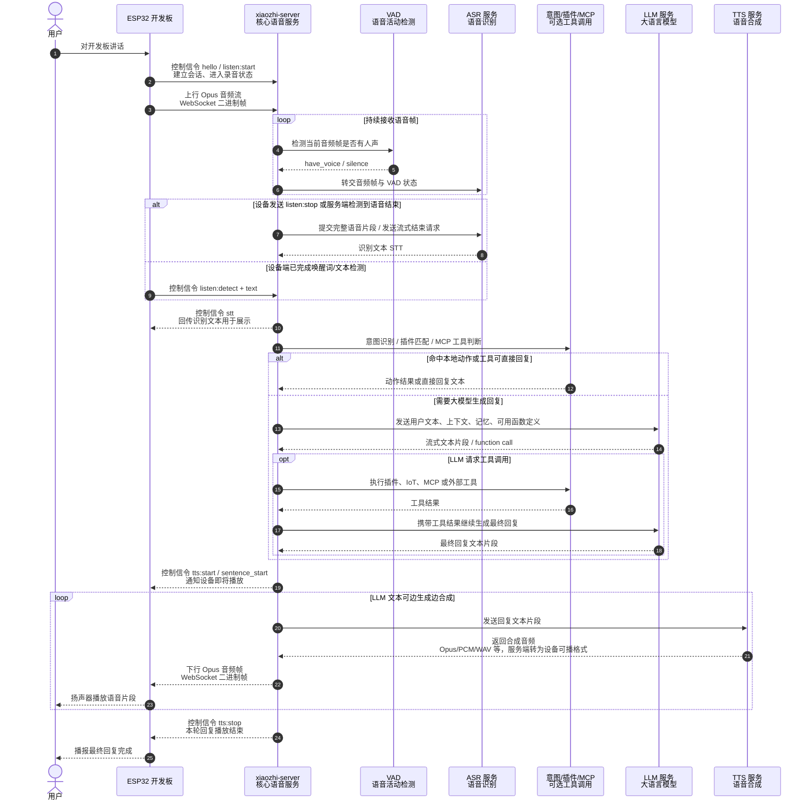

# 小智语音通信端到端执行流程图

本文用流程图展示一次典型语音对话从“用户对开发板讲话”到“开发板播报最终回复”的端到端执行过程，重点说明语音数据与控制信令在开发板、`xiaozhi-server` 以及 ASR、LLM、TTS 等第三方服务之间的流转顺序。

> 说明：下图以 WebSocket 直连为主线；若使用 MQTT 网关，设备侧音频与控制消息会先经 MQTT/UDP 网关转发，再进入相同的服务端处理链路。

## 数据与信令分层

| 阶段 | 主要数据 | 方向 | 说明 |
| --- | --- | --- | --- |
| 建连与会话初始化 | `hello`、会话 ID、设备信息 | 开发板 → 服务器 | 建立实时双向通信，服务器初始化 VAD、ASR、LLM、TTS 等模块。 |
| 开始拾音 | `listen:start` 控制信令 | 开发板 → 服务器 | 服务器清理上一轮音频状态，准备接收新一轮语音。 |
| 上行语音 | Opus 音频二进制帧 | 开发板 → 服务器 | 开发板持续推送麦克风音频，服务器边收边进行 VAD/ASR 处理。 |
| 语音结束 | `listen:stop` 或 VAD 结束判断 | 开发板/服务器内部 | 非流式 ASR 在语音结束后提交完整片段；流式 ASR 则发送结束请求。 |
| 识别结果 | STT 文本 | ASR → 服务器 → 开发板 | ASR 返回用户文本，服务器通过 `stt` 信令回传给设备用于显示。 |
| 语义处理 | 用户文本、上下文、函数定义、工具结果 | 服务器 ↔ LLM/插件/MCP | 服务器先做意图与工具判断；需要时调用 LLM，LLM 可进一步触发插件、IoT 或 MCP 工具。 |
| 语音合成 | 回复文本片段、合成音频 | 服务器 ↔ TTS | LLM 流式输出的文本会进入 TTS 队列，支持边生成边合成。 |
| 下行播报 | `tts:start`、`sentence_start`、Opus 音频、`tts:stop` | 服务器 → 开发板 | 服务器先发送播放状态信令，再发送音频帧，结束时发送 `tts:stop`。 |

## 关键时序说明

1. **控制信令与音频数据分离**：`hello`、`listen`、`stt`、`tts` 等 JSON 文本消息负责驱动状态机；音频则以二进制帧传输。
2. **VAD 与 ASR 协同**：服务器收到每个音频帧后先做 VAD，再把音频与人声状态交给 ASR；流式 ASR 可持续识别，非流式 ASR 通常在 `listen:stop` 后统一识别。
3. **LLM 与工具调用可递归**：如果 LLM 返回 function call，服务器会执行插件、IoT、MCP 或外部工具，并把工具结果补回对话上下文后继续请求 LLM，直到得到可播报的回复。
4. **TTS 可流式播报**：LLM 生成的文本片段会被持续推入 TTS 队列，TTS 音频生成后立即下发给开发板，从而降低首句响应延迟。
5. **打断与状态同步**：若用户在设备播报时再次说话，非手动模式下服务器会发送中止/停止播放相关信令，清理当前 TTS 状态并进入新一轮拾音。
